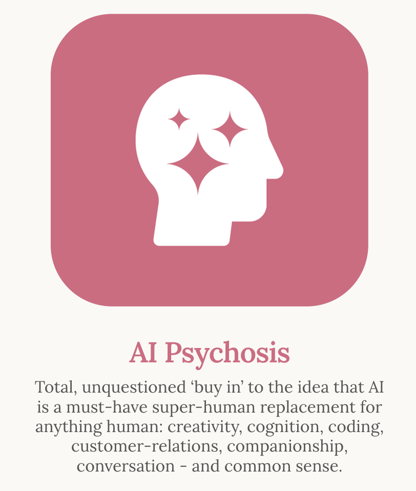
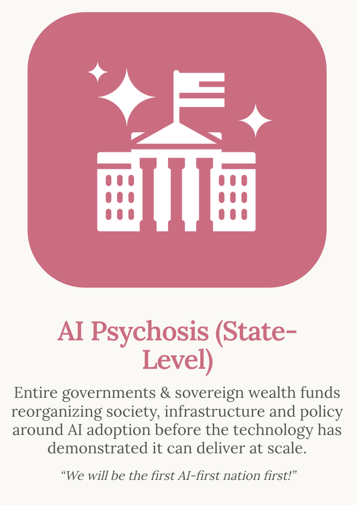
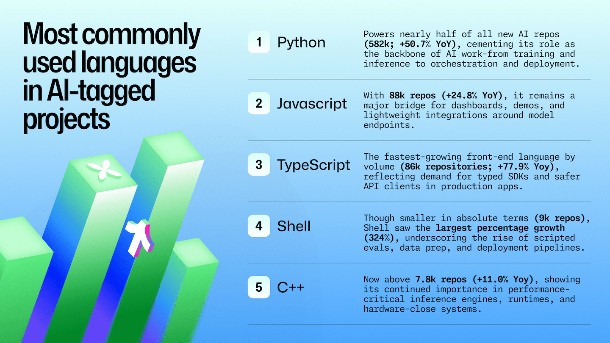
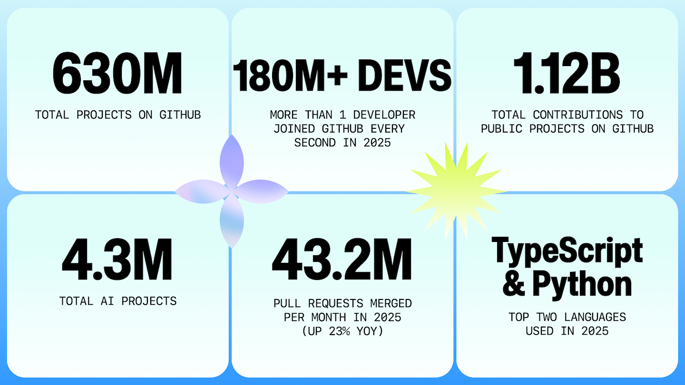

# LLM-AI-Project

<h2>What is AI?</h2>

<b>Artificial intelligence (AI)</b> is technology that enables computers and machines to simulate human learning, comprehension, problem solving, decision making, creativity and autonomy. - IBM

<h2>What doesn't change?</h2>

<b>Software will be getting more complex. Software will always need maintenance: bit-rot is a fact of
life. So is entropy. Technology (hardware and software) will move forward, for better or worse. The
tower (skyscraper?) of abstractions grows ever higher.
Users will always want more and be prepared to spend less. They still won't know how to relay their
needs and wants. Worse, they still won't know exactly what they want. The disconnect between the
customers (who actually pay for the software) and users (who use it) will still be here, as will the
tension between the needs of the business and the needs of its customers. - Senko Rašić</b>

<h2>Examples of AI induced mental habits & compulsions</h2>

Source: information is beautiful

Link: https://informationisbeautiful.net/visualizations/ai-induced-mental-disorders-ai-mental-health-glossary-burnout-addiction-mania/

<h2>What is a Large Language Model (LLM)?</h2>

A <b>large language model (LLM)</b> is a type of artificial intelligence (AI) program that can recognize and generate text, among other tasks. LLMs are trained on huge sets of data — hence the name "large." LLMs are built on machine learning: specifically, a type of neural network called a transformer model. - CLOUDFLARE

<h2>What is Retrieval Augmented Generation (RAG)?</h2>

A technique that enhances LLMs by <b>integrating them with external data sources.</b> - DATACAMP
 

<h2>What is Model Context Protocol (MCP)?</h2>

An open standard that enables developers to build secure, <b>two-way connections between their data sources and AI-powered tools</b>. - ANTHROPIC

<h2>Common business applications <b>(CBA)</b></h2>

(1) Customer support <b>automation</b>

(2) Content <b>classification</b> and tagging

(3) Document analysis and <b>summarization</b>

(4) Email drafting and response <b>generation</b>

<b>ACSG</b> or <b>(Automation, classification, summarization, generation)</b>

<h2>Model Collapse (Words of Caution):</h2>

Peter Truchly raised the real nightmare scenario:
"I just hope that conversation data is used for training, otherwise the only entity left to build that knowledge base is AI itself."

<b>Think about what happens:</b>

<b>1. AI trains on human knowledge (Stack Overflow, docs, forums)</b>

<b>2. Humans stop creating public knowledge (we use AI instead)</b>

<b>3. New problems emerge (new frameworks, new patterns)</b>

<b>4. AI trains on... AI-generated solutions to those problems</b>

<b>5. Garbage in, garbage out, but at scale</b>

Daniel Nwaneri from dev.to

Source: https://dev.to/dannwaneri/were-creating-a-knowledge-collapse-and-no-ones-talking-about-it-226d

<h2>Buy me a Kopiko</h2>

<h3>Source: GitHub</h3>

<h2>The Great Flood (Korean Movie)</h2>

<b>When a raging flood traps a researcher and her young son, a call to a crucial mission puts their escape — and the future of humanity — on the line.</b>

<b>Theme: Human emotions, AI, Survival.</b>

<h2>Cortana Example</h2>

Image: Cortana was a <b>smart artificial intelligence construct (smart AI).</b>

Comment: In real life, we are now in the "proto-dumb AI era".

<h3>Source: Halo Video Game Series</h3>

<h2>Rampancy</h2>

Rampancy is a <b>terminal state of being for artificial intelligence constructs in which the AI behaves contrary to its programming-imposed constraints</b>.

Comment: In real life, we call this "hallucination".

<h3>Source: Halo Video Game Series</h3>

<h2>Technological Achievement Tiers (based on Kardashev scale)</h2>

A Technological Achievement Tier was a level of categorization used by the Forerunners to assess the technological advancement of civilizations. There are a total of 8 tiers, and the lower the Tier number, the more advanced the civilization's technology is/was.

<h3>Tier 7: Pre-Industrial</h3>

Tier 7 is one of the most common and stable states, with limited weaponry and environmental threats. <b>Societies tend to be small and scattered, driven by subsistence farming, foraging, or hunter-gathering needs</b>. Technology is limited to simple hand made tools, weapons, or agrarian implements and methods, but a very broad understanding of planetary and solar mechanics is not uncommon.

<h3>Tier 6: Industrial</h3>

Tier 6 is the outset for massive urbanization. Agrarian societies can remain stable in the pre-industrial stage, but Tier 6 population strain and mechanized food production invariably create political and economic pressures very few can balance. Moving past this usually promises advancement. <b>Some societies improve environmental and medical understanding concurrently with mechanical and transport advancement</b>. Those that do not are frequently doomed. Humanity stood on this level from the late 18th to the mid-20th century. 

<h3>Tier 5: Atomic Age</h3>

Tier 5 species usually begin focusing on clean energy production. The occasional <b>belligerent species will use atomic energy for weapons, often resulting in mass extinctions</b>. In-atmosphere craft are a hallmark, often leading to manned space flight, albeit in a short-scale. Humanity entered this age in 1945, when the first atomic bombs were dropped on Hiroshima and Nagasaki in Japan.

<h3>Tier 4: Space Age (Comparable to real life)</h3>

Tier 4 is often the final resting place for <b>species intelligent enough to break free from their cradle's surface only to fill the gulf surrounding it with war</b>. Their comfort-focused technology can include medical advances.

<h3>Tier 3: Space-Faring</h3>

Species has efficient slipspace navigation, mass drivers, asynchronous linear-induction weapons, holocrystal storage and <b>semi-sentient AI</b>—though their creation requires memory transfer from the freshly deceased and/or flash cloning. They have had no outside influence.

<h3>Tier 2: Interstellar</h3>

The species has the ability to perform exceedingly <b>accurate slipspace navigation, near-instantaneous interstellar communication and man-portable application of energy manipulation</b>.

<h3>Tier 1: World Builder</h3>

The species has the ability to manipulate gravitational forces, <b>create AI with full sentience</b>, fabricate super-dense materials, perform super-accurate slipspace navigation, the <b>ability to create life, and the ability to create worlds</b>.

<h3>Tier 0: Transsentient</h3>

A theoretical ceiling. It is suspected that they <b>can travel between galaxies and accelerate the evolution of intelligent life</b>.
The state of transsentience is evidently connected less to the level of available technology as understood in the traditional sense and more to a metaphysical elevation of the beings themselves beyond conventional existence.

<h3>Source: Halo Video Game Series</h3>

