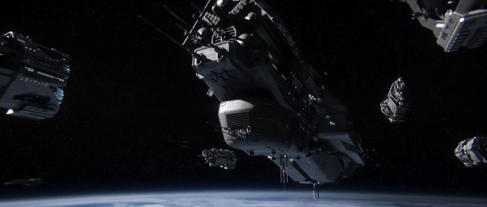

# LLM-AI-Project

<h2>What is AI?</h2>

Artificial intelligence (AI) is technology that enables computers and machines to simulate human learning, comprehension, problem solving, decision making, creativity and autonomy. - IBM

<h2>What is a large language model (LLM)?</h2>

A large language model (LLM) is a type of artificial intelligence (AI) program that can recognize and generate text, among other tasks. LLMs are trained on huge sets of data — hence the name "large." LLMs are built on machine learning: specifically, a type of neural network called a transformer model. - CLOUDFLARE

<h2>What is Model Context Protocol?</h2>

An open standard that enables developers to build secure, two-way connections between their data sources and AI-powered tools. - ANTHROPIC

<h2>Cortana</h2>
<h3>Gender: Female programming</h3>
<h3>Primary function: Software Infiltration</h3>

Image: Cortana, UNSC Artificial intelligence (SN: CTN 0452-9), was a smart artificial intelligence construct.

<h3>Source: Halo Video Game Series</h3>

<h2>Rampancy</h2>

Rampancy is a <mark>terminal state of being for artificial intelligence constructs in which the AI behaves contrary to its programming-imposed constraints</mark>. Traditionally, this is linked with the <mark>AI developing a longing for godlike power and contempt for its mentally inferior makers</mark>. When rampancy occurs, there is no way to restore the AI to its previous state and the only alternative is to destroy it before it harms itself and others around it.

<h3>Source: Halo Video Game Series</h3>

<h2>Technological Achievement Tiers</h2>

A Technological Achievement Tier was a level of categorization used by the Forerunners to assess the technological advancement of civilizations. There are a total of 8 tiers, and the lower the Tier number, the more advanced the civilization's technology is/was.

<h3>Tier 7: Pre-Industrial</h3>

Tier 7 is one of the most common and stable states, with limited weaponry and environmental threats. Societies tend to be small and scattered, driven by <mark>subsistence farming, foraging, or hunter-gathering needs</mark>. Technology is limited to simple hand made tools, weapons, or agrarian implements and methods, but a very broad understanding of planetary and solar mechanics is not uncommon.

<h3>Tier 6: Industrial</h3>

Tier 6 is the outset for massive urbanization. Agrarian societies can remain stable in the pre-industrial stage, but Tier 6 population <mark>strain and mechanized food production invariably create political and economic pressures very few can balance</mark>. Moving past this usually promises advancement. Some societies <mark>improve environmental and medical understanding concurrently with mechanical and transport advancement</mark>. Those that do not are frequently doomed. Humanity stood on this level from the late 18th to the mid-20th century. 

<h3>Tier 5: Atomic Age</h3>

Tier 5 species usually begin <mark>focusing on clean energy production</mark>. The occasional <mark>belligerent species will use atomic energy for weapons, often resulting in mass extinctions</mark>. In-atmosphere craft are a hallmark, often leading to manned space flight, albeit in a short-scale. Humanity entered this age in 1945, when the first atomic bombs were dropped on Hiroshima and Nagasaki in Japan.

<h3>Tier 4: Space Age (Comparable to real life)</h3>

Tier 4 is often the final resting place for <mark>species intelligent enough to break free from their cradle's surface only to fill the gulf surrounding it with war</mark>. Their comfort-focused technology can include medical advances.

<h4>Comment: Warning on War</h4>

"Ten thousand years ago, humans had fought a war against Forerunners — and lost. The centers of human civilization had been dismantled and the humans themselves devolved and shattered into many forms, some said as punishment — but more likely because they were a naturally violent species."
    — Bornstellar Makes Eternal Lasting (Source: Halo Video Game Series)

Comment: The character is alluding to this (below) through "force de-evolution" into multiple subspecies as a result of defeat in war (unconditional surrender).

Image: All extant species of hominid: Top) Human, Middle) Common chimpanzee, bonobo, western gorilla & eastern gorilla, Bottom) Bornean, Sumatran & Tapanuli orangutan

Image Source: Wikimedia Commons

<h3>Tier 3: Space-Faring</h3>

Species has <mark>efficient slipspace navigation, mass drivers, asynchronous linear-induction weapons, holocrystal storage and semi-sentient AI</mark>—though their creation requires memory transfer from the freshly deceased and/or flash cloning. They have had no outside influence.

<h3>Tier 2: Interstellar</h3>

The species has the ability to <mark>perform exceedingly accurate slipspace navigation, near-instantaneous interstellar communication and man-portable application of energy manipulation</mark>.

<h3>Tier 1: World Builder</h3>

The species has the <mark>ability to manipulate gravitational forces, create AI with full sentience, fabricate super-dense materials, perform super-accurate slipspace navigation, the ability to create life, and the ability to create worlds</mark>.

<h3>Tier 0: Transsentient</h3>

A theoretical ceiling. It is suspected that they <mark>can travel between galaxies and accelerate the evolution of intelligent life.</mark>
The state of transsentience is evidently connected less to the level of available technology as understood in the traditional sense and more to a metaphysical elevation of the beings themselves beyond conventional existence.

<h3>Source: Halo Video Game Series</h3>

